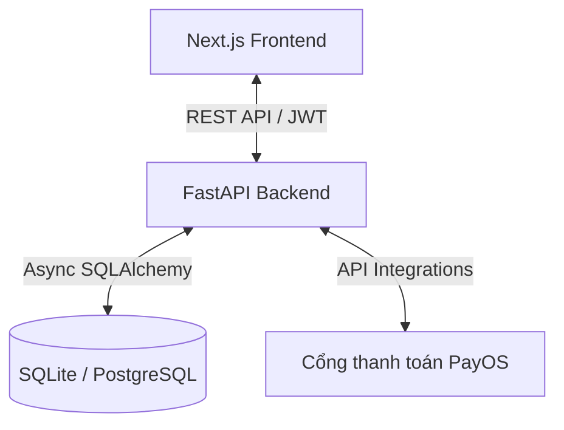

# Kén Startup 🚀
### High-Concurrency Marketplace & Batch Delivery Fintech Engine

**Kén Startup** là một nền tảng thương mại điện tử kết hợp giao hàng theo lô (Batch Delivery) và giải pháp thanh toán điện tử (Fintech) có hiệu năng cao. Hệ thống được thiết kế để giải quyết bài toán tối ưu hóa chi phí giao hàng chặng cuối (last-mile logistics) tại các khu vực đô thị và tòa nhà văn phòng mật độ cao thông qua cơ chế gom đơn thông minh (batching) và tích hợp cổng thanh toán trực tuyến.

---

## 🏗️ Kiến trúc Hệ thống (Architecture)

Hệ thống được thiết kế theo mô hình **Client-Server** phân tách rõ ràng giữa Frontend và Backend:



- **Frontend**: Ứng dụng Single Page đa vai trò (Multi-role App) được xây dựng trên nền tảng Next.js (App Router), React 19, Tailwind CSS và Shadcn/UI, mang lại trải nghiệm mượt mà, hỗ trợ Dark/Light mode và giao diện tương tác thời gian thực.
- **Backend**: API Engine sử dụng FastAPI (Python) bất đồng bộ (Asynchronous), hỗ trợ xử lý đồng thời cao (High-Concurrency), tích hợp SQLAlchemy để tương tác với cơ sở dữ liệu và hệ thống xác thực bảo mật JWT.

---

## 🌟 Các Tính năng Chính theo Vai trò (Key Features)

Nền tảng hỗ trợ **4 vai trò người dùng chính** với các phân hệ chức năng chuyên biệt:

### 1. 🧑‍🦱 Khách hàng (Customer App)
- **Khám phá ẩm thực**: Tìm kiếm, lọc món ăn theo danh mục (Phở, Cơm, Bánh mì, Đồ chay, Lẩu, Đồ uống) và khu vực (Quận/Phường).
- **Giỏ hàng & Khuyến mãi**: Quản lý giỏ hàng linh hoạt, áp dụng mã giảm giá (Vouchers) theo từng cửa hàng hoặc toàn sàn.
- **Ví điện tử Kén**: Thanh toán trực tiếp bằng số dư ví. Tích hợp cổng thanh toán trực tuyến **PayOS** để nạp tiền vào ví bằng mã VietQR vô cùng nhanh chóng.
- **Theo dõi đơn hàng**: Cập nhật trạng thái đơn hàng theo thời gian thực (Chờ xác nhận ➜ Đang nấu ➜ Đang giao ➜ Đã nhận).

### 2. 🚴 Tài xế (Driver App)
- **Nhận chuyến giao hàng theo lô (Batch Delivery)**: Nhận các lô đơn hàng đã được gom sẵn theo khu vực tòa nhà để tối ưu hóa quãng đường.
- **Quản lý quy trình giao hàng**: Cập nhật chu trình giao hàng chi tiết (Nhận đơn ➜ Đến cửa hàng lấy hàng ➜ Đến tòa nhà đích ➜ Giao vào tủ Locker / Bàn giao trực tiếp).
- **Quản lý ký quỹ (Deposit)**: Kiểm tra ví tài xế, quản lý tiền ký quỹ an toàn để đảm bảo quyền lợi và trách nhiệm của tài xế.

### 3. 🏪 Cửa hàng đối tác (Partner/Merchant Dashboard)
- **Quản lý thực đơn**: Quản lý danh sách món ăn, giá bán, hình ảnh và trạng thái còn/hết hàng.
- **Xử lý đơn hàng**: Nhận thông tin đơn hàng mới, cập nhật trạng thái chế biến (Đang nấu).
- **Quản lý dòng tiền**: Xem số dư ví doanh thu cửa hàng, kiểm tra chiết khấu hoa hồng tự động (mặc định 15%) trên mỗi đơn hàng thành công.

### 4. 🔑 Quản trị viên (Admin Portal)
- **Bảng điều khiển (Dashboard)**: Theo dõi trực quan doanh thu tổng (GMV), số lượng đơn hàng, biểu đồ tăng trưởng và bản đồ nhiệt (Heatmap) mật độ đơn hàng/tài xế tại các khu vực.
- **Quản lý gom đơn (Batch Management)**: Gom các đơn hàng lẻ có cùng điểm đến (tòa nhà) thành các lô hàng (Batches) và chỉ định tài xế giao.
- **Quản lý ví & Giao dịch**: Thực hiện điều chỉnh số dư ví thủ công, phê duyệt giao dịch nạp/rút tiền của khách hàng và tài xế.
- **Quản lý danh mục**: Thêm/sửa/xóa thông tin tòa nhà văn phòng và các món ăn trên hệ thống.

---

## 🛠️ Công nghệ Sử dụng (Tech Stack)

### Backend
- **Framework**: [FastAPI](https://fastapi.tiangolo.com/) (Python)
- **Database ORM**: [SQLAlchemy](https://www.sqlalchemy.org/) (Asyncio)
- **Database**: SQLite (dùng cho phát triển nhanh qua `aiosqlite`) hoặc PostgreSQL (cho production)
- **Thanh toán**: [PayOS SDK](https://payos.vn/)
- **Xác thực**: JWT (JSON Web Tokens), `passlib` (Bcrypt)
- **Kiểm thử**: `pytest`, `pytest-asyncio`, `httpx`

### Frontend
- **Framework**: [Next.js](https://nextjs.org/) (App Router, React 19)
- **CSS & UI**: Tailwind CSS, [Shadcn UI](https://ui.shadcn.com/)
- **Biểu đồ**: [Recharts](https://recharts.org/)
- **Icons**: Lucide React
- **HTTP Client**: Axios

---

## ⚙️ Hướng dẫn Cài đặt & Chạy Thử (Installation & Setup)

### Yêu cầu hệ thống
- **Python** >= 3.10
- **Node.js** >= 18.x
- **npm** hoặc **pnpm**

---

### 1. Cấu hình Backend

1. **Di chuyển vào thư mục backend**:
   ```bash
   cd backend
   ```

2. **Tạo môi trường ảo và kích hoạt**:
   - Trên Windows:
     ```bash
     python -m venv venv
     .\venv\Scripts\activate
     ```
   - Trên macOS/Linux:
     ```bash
     python3 -m venv venv
     source venv/bin/activate
     ```

3. **Cài đặt các gói phụ thuộc**:
   ```bash
   pip install -r requirements.txt
   ```

4. **Tạo file cấu hình môi trường**:
   Sao chép file `.env.example` thành `.env` và cập nhật thông tin cấu hình (như thông tin API PayOS nếu cần):
   ```bash
   cp .env.example .env
   ```

5. **Khởi chạy ứng dụng backend**:
   ```bash
   uvicorn app.main:app --reload
   ```
   *Lưu ý: Lần đầu tiên chạy, hệ thống sẽ tự động khởi tạo cơ sở dữ liệu SQLite (`ken_db.sqlite`) và thêm dữ liệu mẫu (seeding) bao gồm các tài khoản, ví, tòa nhà và món ăn mẫu.*

6. **Tài liệu API (Swagger UI)**:
   Sau khi chạy, truy cập [http://127.0.0.1:8000/docs](http://127.0.0.1:8000/docs) để xem tài liệu chi tiết của API.

---

### 2. Cấu hình Frontend

1. **Di chuyển vào thư mục frontend**:
   ```bash
   cd ../frontend
   ```

2. **Cài đặt các thư viện**:
   ```bash
   npm install
   # hoặc dùng pnpm
   pnpm install
   ```

3. **Cấu hình môi trường**:
   Tạo file `.env.local` ở thư mục root của frontend với nội dung chỉ định API Backend (mặc định là `http://localhost:8000`):
   ```env
   NEXT_PUBLIC_API_URL=http://localhost:8000
   ```

4. **Khởi chạy ứng dụng frontend**:
   ```bash
   npm run dev
   ```
   Mở trình duyệt truy cập: [http://localhost:3000](http://localhost:3000)

---

## 🔑 Tài khoản Thử nghiệm (Demo Credentials)

Khi chạy ứng dụng lần đầu tiên, cơ sở dữ liệu sẽ tự động được gieo (seed) các tài khoản mẫu sau để bạn có thể kiểm thử tất cả các chức năng:

| Vai trò | Email đăng nhập | Mật khẩu mặc định | Thông tin bổ sung |
| :--- | :--- | :--- | :--- |
| **Khách hàng** | `customer@ken.vn` | `customer123` | Có sẵn 200,000₫ trong ví để đặt đơn hàng |
| **Tài xế** | `driver@ken.vn` | `driver123` | Tài xế Nguyễn Văn Hùng (Ví ký quỹ: 100,000₫) |
| **Cửa hàng** | `phothin@ken.vn` | `merchant123` | Phở Thìn Lò Đúc |
| **Cửa hàng** | `huonglien@ken.vn` | `merchant123` | Bún Chả Hương Liên |
| **Quản trị viên** | `admin@ken.vn` | `admin123` | Admin Kén Startup, quyền quản lý toàn hệ thống |

*(Và các cửa hàng khác như `comtamsaigon@ken.vn`, `banhmi25@ken.vn`, `annhienvegan@ken.vn`... với cùng mật khẩu `merchant123`)*

---

## 🧪 Chạy Kiểm thử (Testing)

Để chạy bộ kiểm thử tự động của backend:
1. Di chuyển vào thư mục `backend`:
   ```bash
   cd backend
   ```
2. Kích hoạt môi trường ảo (`venv`).
3. Chạy lệnh:
   ```bash
   pytest
   ```

---

## 📄 Giấy phép (License)
Dự án được phân phối dưới giấy phép MIT. Xem chi tiết tại file `LICENSE` (nếu có).
